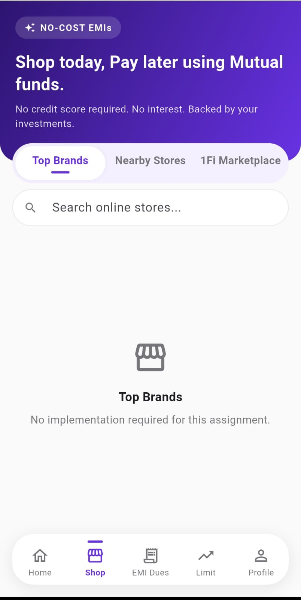
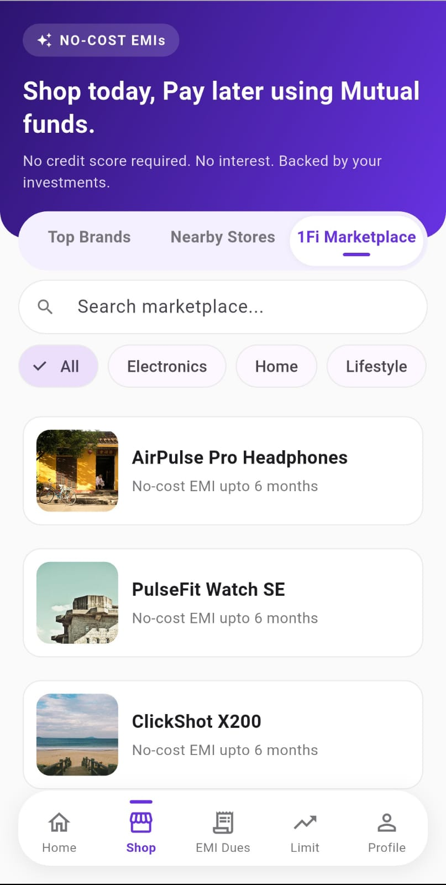
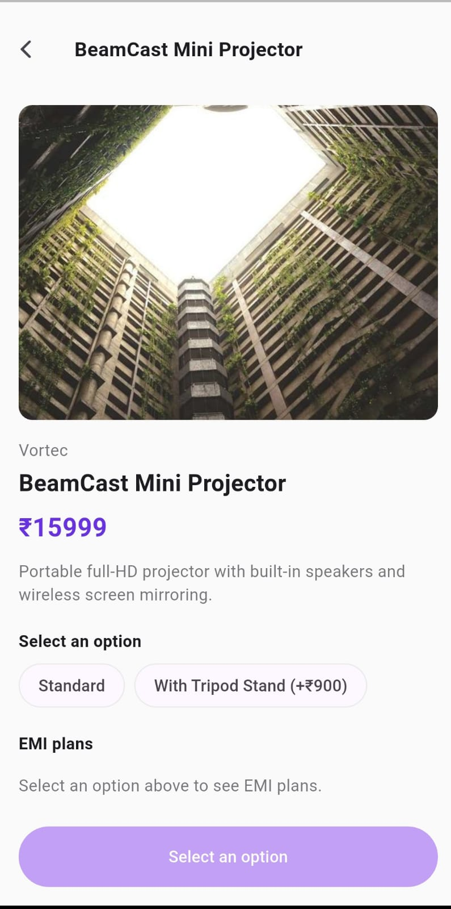
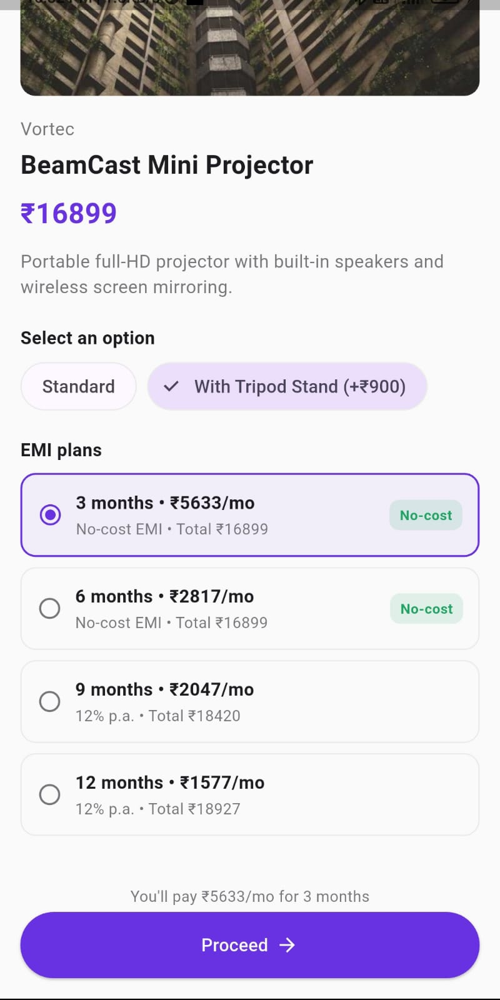

# 1Fi Marketplace

A Flutter implementation of the **1Fi Marketplace** section inside the existing Shop page — built for the 1Fi SDE Intern take-home assignment. Users can browse products, select a variant and an EMI plan, and proceed — built to match the real 1Fi app's UI, navigation, and interaction patterns rather than a generic e-commerce template.

---

## Screenshots

| Shop — Top Brands *(existing)* | Shop — 1Fi Marketplace | Product Detail | EMI Selection | Order Summary |
|---|---|---|---|---|
|  |  |  |  |  |

*Add these five images to a `screenshots/` folder at the repo root and update the filenames above if different. The first shows the existing Top Brands tab for direct visual comparison; the other four walk through the built feature.*

**APK:** [Download APK](https://github.com/originehsan/1Fi_assignment/releases/tag/apk)

---

## What's implemented

Per the assignment brief — Shop page with three options, only Marketplace fully built:

- **Top Brands** — blank, as specified
- **Nearby Stores** — blank, as specified
- **1Fi Marketplace** — fully implemented:
  - Product listing (image, name, EMI availability) as a vertical list, matching the existing Top Brands card layout
  - Search, shared across all three Shop tabs with a tab-specific placeholder, and category filtering
  - Product detail — image, name, price, description, variant selection, EMI plan selection, relevant product details
  - EMI plan selection with no-cost and interest-bearing plans clearly distinguished
  - CTA to proceed, an order summary, and a demo confirmation step
  - Loading, error (with retry), and empty states throughout, including distinguishing "marketplace has no products" from "your search or filter matched nothing"

## Design and engineering notes

**UI/UX consistency.** The real 1Fi app was reviewed directly — screenshots compared against the build across multiple iterations, not designed from assumption. This shaped specific decisions:
- Product detail opens as a near-full-height modal bottom sheet, not a new screen, matching the real app's behavior.
- The Shop page's segmented tab control, hero banner, and floating bottom navigation (line indicator, not a filled background) mirror the real app's component treatments.
- Product cards omit price from the listing view, matching the existing Top Brands pattern (image, name, EMI availability); full pricing appears on the detail view.
- Colors, spacing, and corner radii were reconciled from screenshot analysis and are documented with a confidence level in `architecture.md` — not asserted as pixel-exact where they aren't.

**Engineering documentation.** Two supporting documents sit at the repo root:
- **`architecture.md`** — system design, layer responsibilities, data/state flow, business-logic ownership, and every architectural trade-off with its rationale and the condition that would justify revisiting it.
- **`rules.md`** — the coding conventions enforced throughout, including a live audit of the codebase against them.

Both were maintained alongside the code, not written after the fact.

---

## Architecture

UI (screens/widgets)
↓ watches
Riverpod (AsyncValue for async data, Notifier for selection state)
↓ calls
MarketplaceRepository (abstract interface)
↓ implemented by
MockMarketplaceRepository (JSON asset + simulated network delay)


- **State management:** Riverpod. `AsyncValue` covers loading, error, and data in one type.
- **Data layer:** a repository interface with a single mock implementation. A real backend requires one new class and a one-line change; nothing above that layer needs to change.
- **Folder structure:** feature-first (`features/shop/marketplace/{models,data,providers,screens,widgets}`), not layered by type. No domain layer, use-case classes, routing package, or dependency-injection framework beyond Riverpod's own provider graph — each omission is a documented decision scoped to this feature's actual complexity, detailed in `architecture.md`.
- **Design tokens:** colors, and any spacing/typography value repeated for the same purpose in two or more places, live in `theme/app_theme.dart` (`AppColors`, `AppSpacing`, `AppRadius`, `AppTextStyles`).

## Project structure

```
lib/
├── main.dart
├── app_shell.dart                    — top-level 5-tab bottom navigation
├── theme/
│   └── app_theme.dart                — design tokens
├── core/
│   └── widgets/
│       └── placeholder_tab.dart
└── features/
    └── shop/
        ├── screens/
        │   └── shop_page.dart        — 3-tab Shop shell
        └── marketplace/
            ├── models/
            │   ├── product.dart
            │   ├── product_variant.dart
            │   └── emi_plan.dart
            ├── data/
            │   ├── marketplace_repository.dart       — abstract interface
            │   └── mock_marketplace_repository.dart  — mock implementation
            ├── providers/
            │   ├── marketplace_provider.dart          — async data, search/filter state
            │   └── product_selection_provider.dart    — variant/EMI selection state
            ├── screens/
            │   └── marketplace_listing_screen.dart
            └── widgets/
                ├── product_list.dart
                ├── product_list_item.dart
                ├── variant_selector.dart
                ├── emi_plan_tile.dart
                ├── product_detail_sheet.dart
                ├── skeleton_views.dart
                └── async_state_views.dart

assets/mock/products.json           — mock product catalog
test/
├── models/emi_plan_test.dart
├── providers/product_selection_notifier_test.dart
└── widget_test.dart
```


## Getting started

```bash
flutter pub get
flutter run
```

Built and tested with Flutter 3.24.x / Dart 3.5.x on a physical Android device.

## Testing

```bash
flutter test
```

Four tests:
- App launch smoke test
- `EmiPlan.calculate()` — no-cost plans split the principal evenly; interest-bearing plans total more than the principal
- The core business rule of this codebase: selecting a new variant clears any previously selected EMI plan, since it was calculated for the old price — verified with a bare `ProviderContainer`, no widget tree required

## Known assumptions and limitations

- All product and EMI data is mock (`assets/mock/products.json`), fabricated for this assignment — not real 1Fi inventory or financing terms.
- EMI tenure and interest rules (3 and 6 months no-cost, 9 and 12 months at a flat 12% p.a.) are demo assumptions, not real 1Fi policy.
- The visual theme was built from screenshot review, not extracted design assets — colors and component styles carry a stated confidence level in `architecture.md`.
- No backend integration — all "network" behavior is a simulated delay over a local asset, structured so a real implementation is a drop-in replacement.
- The order-confirmation step is a demo — no checkout, payment, or persistence, consistent with the assignment's stated scope.
- Top Brands, Nearby Stores, and the four non-Shop bottom-nav tabs are intentionally blank placeholders, per the assignment's note that only the Marketplace section requires implementation.
